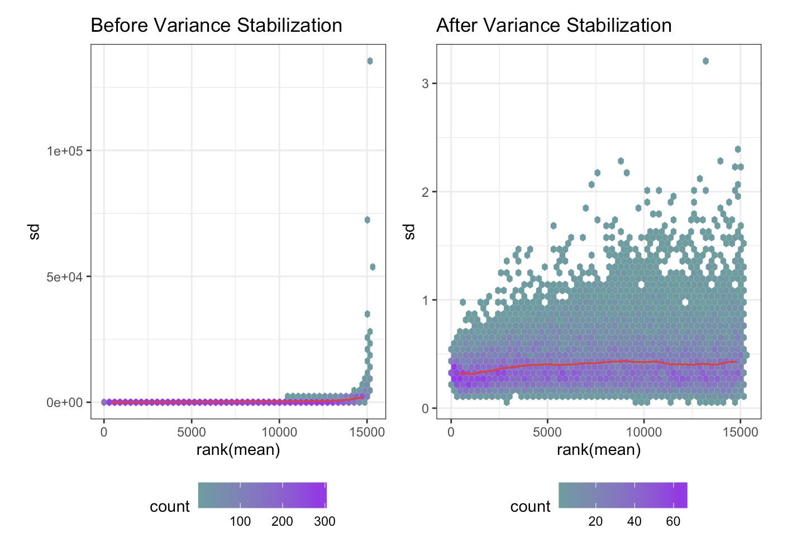
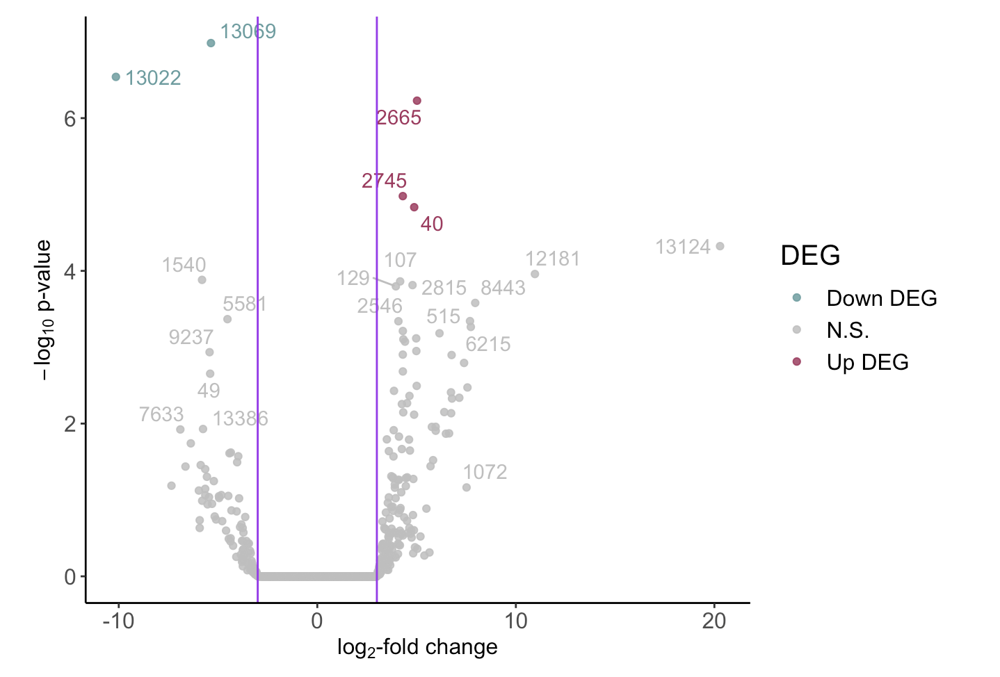

```{r setup, include=FALSE}
knitr::opts_chunk$set(echo = TRUE,
                      cache = TRUE, 
                      cache.comments = TRUE,
                      size = 13)
```

```{r, echo=FALSE, message=FALSE, warning=FALSE, results='hide'}
# Turn off scientific notation
options(scipen=999)

# Set seed; add CMRG for parallelization
set.seed(50009, "L'Ecuyer-CMRG")

# Clean, set up, and load
pacman::p_unload(pacman::p_loaded(), character.only = TRUE)
rm(list = ls(all = TRUE))

pacman::p_load(tidyverse, 
               ggplot2, 
               kableExtra,
               DESeq2,
               RColorBrewer,
               gridExtra,
               vsn, 
               miniml, 
               ggrepel,
               e1071,
               glmnet, 
               Biobase, 
               caret,
               GEOquery, 
               ROCR, 
               pROC, 
               randomForest,
               ranger,
               multtest,
               nestedcv,
               Rfast, 
               pdp, 
               vip, 
               kernlab, 
               BiocManager, 
               readr
)
```


# Background and Hypothesis
    The impact of environmental abiotic factors on gene expression is not well understood. Specifically, plants are immobile and must weather a wide variety of these abiotic stresses, which negatively impact plant growth. Plants can respond to these stresses by adjusting gene transcription and protein activity; however, stressors have been shown to have different effects on plants when combined (Ambroise et al., 2024).  
    Ambroise et al. performed a controlled study on the impact of heavy metal and cold on *Salix viminalis* (Willow Tree) gene expression. The study produced count values which were used to identify differentially expressed genes (DEGs). In this paper, our aim was to examine the counts using a new DESeq2 and Random Forest model to identify DEGs.  
    We hypothesize that willow trees that are exposed to more abiotic stressors such as cold or metal exposure will express different genes compared to normal conditions, because plants will often respond to cold by altering expression of genes involved in cold acclimatization and metals typically trigger genes associated with metal detoxification.  

# Data Source
    The *Salix viminalis* data was collected by Ambroise et al. during their investigation into the DEGs caused by heavy metal and cold exposure; their goal was to study the interaction between cold acclimation and heavy metals. They used four sample groups: control soil temperate (CT), control soil cold acclimated (CC), metal-polluted soil temperate (MT), and metal-polluted soil cold acclimated (MC). Plants were exposed to metals for two months before being exposed to cold for one month (Amroise et. al, 2024).  
    The original analysis done by Ambroise et al. was performed using the edgeR package. Our analysis was performed using DESeq2 using the total contig. reads of each gene for each of the 12 samples.  

# Results and Analysis
### Data Preprocessing
    We began by loading the processed data and gene annotation files. The dataset comprised of total reads for each gene across 12 samples categorized into four treatment groups: control soil temperate (CT), control soil cold-acclimated (CC), metal-polluted soil temperate (MT), and metal-polluted soil cold-acclimated (MC). Metadata was also incorporated to provide contextual information for each sample. Column names were standardized to avoid potential errors in downstream analysis, and the data was converted to an appropriate format for DESeq analysis.  
    Next, we created a DESeqDataSet object using the gene count data and metadata. The DESeqDataSet serves as a container for storing gene expression data along with experimental information, facilitating the application of DESeq2’s statistical methods. Additionally, to address the inherent variability in RNA-seq data, we applied a Variance Stabilizing Transformation (VST). This method normalizes the data by transforming count data and is particularly useful for reducing heteroscedasticity, making the data more amenable to analysis using linear models. The effectiveness of the VST was evaluated by plotting the mean-variance relationship before and after transformation (Figure 1). Post-transformation, the data exhibited a more linear relationship, indicating successful stabilization of variance.  
```{r, echo=FALSE, message=FALSE, warning=FALSE}
  
```
  
*Figure 1: Effects of the Variance Stabilizing Transformation on the data*  

### Differential Gene Expression Analysis
    With the transformed data, we performed differential gene expression analysis using DESeq2. Size factors were estimated to normalize for differences in sequencing depth, and dispersions were calculated to model gene expression count variability. We used the negative binomial Wald test to identify genes that were differentially expressed between the treatment groups. Our analysis revealed that out of 15,173 genes, five exhibited significantly differential expression (adjusted p-value <0.05, log-fold change threshold of 3). Specifically, three genes were upregulated and two genes were downregulated in response to the combined stress of heavy metals and cold acclimation. To visualize the results, we generated a volcano plot. This plot highlights the genes with significant changes in expression levels, displaying the relationship between the magnitude of change (log-fold change) and statistical significance (adjusted p-value) (Figure 2).  
```{r, echo=FALSE, message=FALSE, warning=FALSE}
  
```
  
*Figure 2: Volcano plot of gene expression*  

### Random Forest Model
    To compare the differential expression analysis with DESeq2, we implemented a Random Forest model to classify the samples based on their treatment groups. The Random Forest algorithm was chosen for its robustness and ability to handle high-dimensional data, making it suitable for gene expression analysis. An out-of-box model was trained using a subset of the preprocessed gene expression data, and its performance was assessed to be 100%, albeit with the limited availability of data. We conducted a grid search to tune the model’s hyperparameters, including the number of variables tried at each split (mtry), the number of trees (ntree), and the split rule (gini or extratrees). The optimized model showed equal classification accuracy.  

### Gene Expression Comparison
    Finally, we focused on identifying genes that were consistently highlighted by both the DESeq2 differential expression analysis and the Random Forest model. This approach ensures robustness in our findings, as genes significant in both analyses are more likely to be true markers of stress response in *Salix viminalis*. Nineteen genes were identified as overlapping between the two analyses, suggesting that these genes are critical components of the willow tree’s responses to metal pollution and cold acclimation. Of note are gene 11, which was found to display different temperature sensitivities; gene 44, which was found to be involved in the production of leaf volatile organic compounds (signaling molecules); and gene 283, which is essential for plant innate immunity (Hooper et al., 2017).  

# Conclusion
    In this study, the impact of abiotic stressors (heavy metal exposure and cold exposure) on gene expression of *Salix viminalis* (Willow Tree) was investigated. Using data sourced from Ambroise et al., 2024, a DESeq2 and Random Forest models were created to identify the differentially expressed genes (DEGs) in willow trees exposed to the abiotic stressors. The two models were then compared with each other, to find overlapping DEGs between models. The results of the DESeq2 model showed that five genes exhibited significant differential expression under combined stress conditions (heavy metal and cold), with three genes being up-regulated and two being down-regulated. When comparing DESeq2 and Random Forest models, nineteen DEGs were found to be overlapping between models. This indicates that these nineteen overlapping genes play a significant role in willow tree stress response, due both models identifying these genes as being important. Notable genes such as gene 11, gene 44, and gene 283 were found to play crucial roles in temperature sensitivity, production of signaling molecules, and plant innate immunity, respectively. These findings contribute to our understanding of how plants, particularly Salix viminalis, adapt to environmental stressors through differential gene expression.

# Limitations
    While this study does offer significant insights and proposes progressive methods in the research of differential gene expression, there are also limitations with the study to be considered. The major limitation was the limited size of the dataset, with only twelve total samples, three of each condition, which drastically limits the range of machine learning techniques that are functional and appropriate to use. With a larger dataset, techniques such as cross-validation could be implemented, but this proved unsuccessful in our attempts with this limited dataset. Bootstrap imputation was considered to provide more data to work with, however, the credibility of the imputed data would be questionable due to the lack of data to resample from. Additionally, the data focuses on a specific time point post-exposure to stressors. Investigation of gene expression changes over multiple time points may provide a more dynamic picture of stress responses.  

# Recommendations and Next Steps
* *Time Series Analysis*: Conducting time series experiments that capture the dynamics of gene expression over time in response to stressors may provide deeper insight.  
* *Increasing Sample Size*: Increasing the number of samples under each condition would allow for better model performance (good generalization, mitigation of overfitting) and allow for more powerful analysis with k-fold and nested cross-validation.  
* *Further Investigation into Key Genes*: Future research should involve a more in-depth study of the function of the identified key genes, particularly those involved in stress response (gene 11, gene 44, and gene 283). A review of current literature on these genes and their role in stress response could help confirm model performance. The significant genes found using these proposed machine-learning methods should also be compared with the genes found by Ambroise et al. to look for similarities in gene expression.  

# Appendix 1: References
Ambroise, V.; Legay, S.; Jozefczak, M.; Leclercq, C.C.; Planchon, S.; Hausman, J.-F.; Renaut, J.; Cuypers, A.; Sergeant, K. Impact of Heavy Metals on Cold Acclimation of Salix viminalis Roots. Int. J. Mol. Sci. 2024, 25, 1545. https://doi.org/10.3390/ijms25031545  
Hooper CM, Castleden I, Tanz SK, Aryamanesh, and Millar, AH (2017) SUBA4: the interactive data analysis centre for Arabidopsis subcellular protein locations Nucleic Acids Res. Jan 4;45(D1):D1064-D1074. doi: 10.1093/nar/gkw1041 

# Appendix 2: Code
## Data Preprocessing 
```{r, message=FALSE, warning=FALSE}
#Load processed data
willow <- read_delim("./Data/GSE218490_Processed_data.txt", delim = "\t", locale = locale(encoding = "UTF-16"))

#Load Gene Annotation Data
#This shows info for each gene
GeneAnnotation <- read_delim("./Data/GSE218490_S.viminalis_root_transcriptome_V1.0.annotation.txt", 
                             delim = ",", 
                             col_names = TRUE)

#Load MetaData
metadata <- read_csv("./Data/salix_metadata.csv")
```
```{r, echo=FALSE, message=FALSE, warning=FALSE}
#Clean willow dataset to just include counts
#Not 100% sure which count to use, but total_contig_reads seemed to match demo 1 the most?
willow <- willow[, c("Feature_ID", "CT_R1-Total_contig_reads", "CT_R2-Total_contig_reads", "CT_R3-Total_contig_reads", "CC_R1-Total_contig_reads", "CC_R2-Total_contig_reads", "CC_R3-Total_contig_reads", "MT_R1-Total_contig_reads", "MT_R2-Total_contig_reads", "MT_R3-Total_contig_reads", "MC_R1-Total_contig_reads", "MC_R2-Total_contig_reads", "MC_R3-Total_contig_reads")]


```

```{r, message=FALSE, warning=FALSE}
#Set Feature_ID as row numbers
rownames(willow) <- willow$Feature_ID
willow <- willow[ ,-1]
```
```{r, echo=FALSE, message=FALSE, warning=FALSE}
rownames(metadata) <- metadata$Accession
metadata <- metadata[ ,-1]
```
```{r, echo=FALSE, message=FALSE, warning=FALSE}
levels(as.factor(metadata$Treatment))
metadata$Treatment <- factor(metadata$Treatment, levels = c("Control", "Cold-Acclimated Control", "Metal-Polluted", "Metal-Polluted Cold-Acclimated"))
```

```{r, message=FALSE, warning=FALSE}
print(all(colnames(counts) %in% rownames(metadata)))
print(all(colnames(counts) == rownames(metadata)))
ncol(willow) == nrow(metadata)
```

```{r, message=FALSE, warning=FALSE}
# Replace - with _ in metadata and willow
metadata$Treatment <- gsub("-", "_", metadata$Treatment)
colnames(metadata) <- gsub("-", "_", colnames(metadata))
colnames(metadata) <- gsub(" ", "_", colnames(metadata))
colnames(willow) <- gsub("-", "_", colnames(willow))
```

## DESeq and VST
```{r, message=FALSE, warning=FALSE}
# Create DESeqDataSet object
dds <- DESeqDataSetFromMatrix(
  countData = willow,
  colData = metadata,
  design = ~ Treatment)

dim(dds)
```

```{r, message=FALSE, warning=FALSE}
# VST function from demo 1
runVST <- function(dsgnObject, blind, fitType, makePlot = TRUE, writeTable = FALSE, writeRData = FALSE) {
  ## Perform the VST
  
  # Check if the fitType is the regularized log:
  if(fitType == "rlog") {
    vsData <- rlog(dsgnObject, blind = blind)
  }
  ## Otherwise:
  else {
    vsData <- varianceStabilizingTransformation(dsgnObject, 
                                              blind = blind, 
                                              fitType = fitType)
  }
  
  if(makePlot == TRUE) {
    # Plot the effect of the VS transform:
    p1 <- meanSdPlot(assay(dsgnObject), plot = F)
    p1 <- p1$gg + ggtitle("Before Variance Stabilization") + 
      scale_fill_gradient(low = "cadetblue", high = "purple") + 
      theme_bw() + theme(legend.position = "bottom")
    p2 <- meanSdPlot(assay(vsData), plot = F)
    p2 <- p2$gg + ggtitle("After Variance Stabilization") + 
      scale_fill_gradient(low = "cadetblue", high = "purple") + 
      theme_bw() + theme(legend.position = "bottom")
    grid.arrange(p1, p2, nrow=1)
  }
  
  if(writeTable == TRUE) {
    # Write the data for future use, if needed:
    write.table(assay(vsData),
              file = "vst.txt",
              sep="\t", 
              quote=F, 
              row.names=T)
  }
  if(writeRData == TRUE) {
    save(vsData, file="vst_all_timepoints.Rdata")
  }
  return(vsData)
}

runVST(dds, blind = FALSE, fitType = "parametric", makePlot = TRUE, writeTable = FALSE, writeRData = TRUE)
```

```{r, message=FALSE, warning=FALSE}
# Gene expression variance by means - should be linear
meanCounts <- rowMeans(assay(dds))      ## Per locus, what is the average expression
varCounts <- apply(assay(dds), 1, var)  ## Apply the variance function by margin = 1, which is rows

plot(log(varCounts) ~ log(meanCounts), 
     ylab = "Natural-log Variance in Gene Expression", 
     xlab = "Natural-log Mean Expression", 
     main = "\nLog-Log plot of variance by mean for each gene\n should be approximately linear.\n", 
     pch = 16, 
     cex = 0.75)
abline(lm(log(varCounts+0.0001) ~ log((meanCounts+0.0001))), 
       col = "#a8325e", 
       lty = 2, 
       lwd = 2)
```

```{r, message=FALSE, warning=FALSE}
# Pre-process the data for DESeq
colnames(colData(dds)) <- gsub("[.-]", "_", colnames(colData(dds)))

# Function to replace unwanted characters in factor levels
sanitize_levels <- function(factor_levels) {
    gsub("[^a-zA-Z0-9_.]", "_", factor_levels)
}

# Apply this function to all factors in colData
col_data <- colData(dds)
for (col in names(col_data)) {
    if (is.factor(col_data[[col]])) {
        levels(col_data[[col]]) <- sanitize_levels(levels(col_data[[col]]))
    }
}

# Update colData in the DESeqDataSet
colData(dds) <- col_data
```

```{r, message=FALSE, warning=FALSE}
# Estimate size factors
dds <- estimateSizeFactors(dds) 

# Determine significantly differentially expressed genes
alpha <- 0.01                                                  ## Setting this for a False Discovery Rate of 1%
dispObject <- estimateDispersions(dds)                         ## Estimate the dispersions
waldObject <- nbinomWaldTest(dispObject)                       ## Use that to perform the negative binomial Wald tests
resultsDESeq <- results(waldObject,
                        alpha = alpha, 
                        pAdjustMethod = "BH",                  ## Uses Benjamini-Hochberg / FDR adjusted p-values
                        lfcThreshold = 3)                      ## Set the log fold change threshold to 3
summary(resultsDESeq)
```

```{r, message=FALSE, warning=FALSE}
# Volcano plot of gene expression
res <- resultsDESeq %>% 
  as.data.frame() %>% 
  mutate(DEG = ifelse(log2FoldChange > 0 & padj < 0.05, "Up DEG",
                       ifelse(log2FoldChange < 0 & padj < 0.05, "Down DEG", "N.S."))) %>% 
  drop_na()    ## We have to drop the NAs for Volcano plots, unfortunately!

# Next, we would like to annotate anything with greater then 2 log-fold change in expression:
res <- res %>% 
  mutate(locus = ifelse(abs(log2FoldChange) > 3, rownames(res), ""))

res %>% 
  ggplot(aes(x = log2FoldChange, y = -log10(pvalue), label=locus, color = DEG)) + 
  geom_point(alpha = 0.85, size = 1.5) +
  scale_color_manual(values=c("cadetblue", "gray", "#a8325e")) +
  geom_text_repel(show.legend = FALSE) +
  labs(y = expression(paste(-log[10], " p-value")),
       x = expression(paste(log[2], "-fold change"))) +
  theme_classic() +
  theme(axis.text = element_text(size = 12), 
        axis.title = element_text(size = 12),
        title = element_text(size = 15),
        legend.text = element_text(size = 12)) +
  geom_vline(xintercept = c(-3, 3), col="purple")                      ## Log-fold change of 3 times
```

## Random Forest
```{r, echo=FALSE, message=FALSE, warning=FALSE, results='hide'}
#Do Splits from Project 1
#So we don't have to reinvent the wheel here
doSplits <- function(vst, algorithm, splitRatio, filterCutoff) {
  ### @vst = vst dataset as extracted from DESeq2
  ### @algorithm = ML algorithm used; currently set up for rf and svm
  ### @splitRatio = the split ratio to employ (training size)
  ### @filterCutoff = the filter cutoff for median number of VST gene counts
  
  ## According to the Valabas et al. (2019) paper, make sure that we are filtering in TRAINING set only! 

  # Extract the VST data and transpose
  tVST <- t(assay(vst))
  
  # We do have gene names, e.g., TRNAV-UAC that are malformed for ranger and randomForest. We will fix that before proceeding:
  for (c in 1:ncol(tVST)) {
    colName <- colnames(tVST)[c]
    colName <- gsub("-", "_", colName)
    colName -> colnames(tVST)[c]
  }
  
  ## Add the metadata as columns & merge
  df1 <- cbind(colData(vst)[1], colData(vst)[3], colData(vst)[2])       ## We don't need the size factors
  tVST <- merge(tVST, df1, by = "row.names")

  ## The merge turns back into a dataframe and removes the sample names from the rows; let's put them back:
  rownames(tVST) <- tVST[,1]
  tVST <- tVST[,-1]
  
  if(algorithm == "svm") {
    ## Make the factors unordered
    tVST <- tVST %>% 
      mutate_if(is.ordered, factor, ordered = FALSE)
  }
  
  ## Create the data partitions
  ind <- createDataPartition(y = tVST[, c("Treatment")],     ## Treatment is evenly distributed
                             p = splitRatio,                    ## % into training
                             list = FALSE)                      ## don't return a list
  train <- tVST[ind, ]
  test <- tVST[-ind,]
  
  ## Now apply the filtering:
  # Calculate row medians of VST gene counts
  medians <- rowMedians(assay(vst))

  # Filter the features out of train:
  train <- train[, medians > filterCutoff]  
  print(paste0("After filtering, the number of genes remaining in the dataset are: ", ncol(train)))

  splits <- list(train, test)
  return(splits)
}
```

```{r, echo=FALSE, message=FALSE, warning=FALSE}
# Load in data
load("vst_all_timepoints.Rdata")

#Split data
#Do before processing to avoid data leakage - adjusted splitRatio to allow for adequate data in the test set
splits <- doSplits(vst = vsData, algorithm = "rf", splitRatio = 0.5, filterCutoff = 5)
train <- splits[[1]]
test <- splits[[2]]
```

```{r, echo=FALSE, message=FALSE, warning=FALSE}
# Functions for comparing genes and comfusion matrices
findOverlappingGenes <- function(lfc, important) {
  ### @lfc = the log-fold change cutoff you'd like to employ on the originall DESeq results
  ### @important = the list, df, or matrix that contains the importance values from the ML classifier; make sure it is already filtered if needed.

  res <- resultsDESeq %>% 
    as.data.frame() %>% 
    filter(abs(log2FoldChange) >= lfc)   # Make sure to filter by the ABSOLUTE VALUE :)
  
  # Move the rownames (genes) back to a column
  res$geneID <- rownames(res)
  # Coerce to a dataframe, if needed
  important <- important %>% 
    as.data.frame() %>% 
    filter()
  # Move the rownames (genes) back to a column, if needed
  if (!"geneID" %in% colnames(important)) {
      important$geneID <- rownames(important)
  }
  #Perform an inner join to find the overlap
  overlap <- inner_join(res, important, by = "geneID")
  
  return(overlap)
}

compareConfusion <- function(confusionList) {
  ## instantiate
  finalDF <- data.frame()
  for(i in 1:length(confusionList)) {
    ## The first one
    if(i == 1) {
      confMat <- confusionList[[i]]   ## grab the first one
      df <- confMat$overall %>% as.data.frame() 
      finalDF <- rownames(df) %>% as.data.frame()
      colnames(finalDF)[1] <- "Metric"
      finalDF$`Confusion Matrix 1`  <- df[, 1]       ## grab the value
    }
    if(i > 1) {
      name <- paste0('Confusion Matrix ', i)
      confMat <- confusionList[[i]]
      df <- confMat$overall %>% as.data.frame()
      finalDF[, name] <- df[, 1]       ## grab the value
    }
  }
  return(finalDF)
}
```

```{r, warning=FALSE}
# OOB rf 
rfOOB <- randomForest::randomForest(
  Treatment ~ ., 
  data = train)

pred.test.rf <- predict(rfOOB, test, type = "response")
confMat <- confusionMatrix(pred.test.rf, test$Treatment)
```

```{r, warning=FALSE}
# rf with grid search
# Define the grid of hyperparameters
hyper_params <- expand.grid(
  mtry = c(50),
  ntree = c(40),
  splitrule = c("gini", "extratrees")
)

# Initialize variables to store models and evaluation results
models <- list()
confusion_matrices <- list()

for (i in 1:nrow(hyper_params)) {
  # Train random forest model with current hyperparameters
  rf_model <- randomForest(
    Treatment ~ .,
    data = train,
    mtry = hyper_params$mtry[i],
    ntree = hyper_params$ntree[i],
    splitrule = hyper_params$splitrule[i]
  )

  # Store the model
  models[[i]] <- rf_model

  # Predict on test set
  pred_test <- predict(rf_model, newdata = test, type = "response")

  # Generate confusion matrix
  conf_matrix <- confusionMatrix(pred_test, test$Treatment)
  confusion_matrices[[i]] <- conf_matrix
}

# Extract performance metrics (e.g., accuracy) from confusion matrices
accuracies <- sapply(confusion_matrices, function(cm) cm$overall['Accuracy'])

# Find index of model with highest accuracy (or other metric of interest)
best_model_index <- which.max(accuracies)

# Retrieve the best model
rfTuned <- models[[best_model_index]]
print(rfTuned)

pred.test.rf.best <- predict(rfTuned, test, type = "response")
confMatTuned <- confusionMatrix(pred.test.rf.best, test$Treatment)
```

```{r, warning=FALSE}
# Comparison of OOB vs tuned RF
compareConfusion(confusionList = list(confMat, confMatTuned)) %>% 
    kable(
    format = "html",
    caption = "Comparing Accuracy - Random Forest") %>%
    kable_styling(bootstrap_options = c("hover", full_width = F))
```

## Gene Expression Comparison
```{r, warning=FALSE}
# Pull important genes
importantRF <- rf_filter(rfTuned, 
                               y = train$Treatment, 
                               x = train[, -ncol(train)], # drop Treatment
                               type ="full") %>% as.data.frame()
names(importantRF) <- "MeanDecreaseGini"

importantRF %>% 
  arrange(desc(abs(MeanDecreaseGini))) %>% 
  head(10) %>% 
kable(
    format = "html",
    caption = "Important Features from the Random Forest Model") %>%
    kable_styling(bootstrap_options = c("hover", full_width = F))

```

```{r, warning=FALSE}
# Find overlapping genes
importantRF_filt <- importantRF %>% 
  as.data.frame() %>% 
  filter(MeanDecreaseGini > 0)
rownames(importantRF_filt) <- gsub("V", "", rownames(importantRF_filt))

overlapping_genes <- findOverlappingGenes(lfc = 3, importantRF_filt) %>%
  arrange(desc(abs(MeanDecreaseGini)))
overlapping_genes %>% 
  kable(
    format = "html",
    caption = "Overlapping Features identified from DESeq and Random Forest") %>%
  kable_styling(bootstrap_options = c("hover", "full_width" = F))
```

```{r}
# Join with gene annotation
GeneAnnotation <- GeneAnnotation %>%
  rownames_to_column(var = "geneID")
ImportantGenesAnnotated <- overlapping_genes %>%
  left_join(GeneAnnotation, by = "geneID")
colnames(ImportantGenesAnnotated) <- gsub("\\s+", "", colnames(ImportantGenesAnnotated), perl = TRUE)

# Select relevant columns
selected_columns <- ImportantGenesAnnotated %>%
  select(geneID, MeanDecreaseGini, Pathway, Symbol, Description)
selected_columns$Pathway <- gsub('"', '', selected_columns$Pathway)
selected_columns$Symbol <- gsub('"', '', selected_columns$Symbol)
selected_columns$Description <- gsub('"', '', selected_columns$Description)

# Create table
selected_columns %>% 
  kable(
    format = "html",
    caption = "Important Genes with Annotations",
    col.names = c("Gene ID", "Mean Decrease Gini", "Pathway", "Symbol", "Description")
  ) %>%
  kable_styling(bootstrap_options = c("hover", "full_width" = F))
```
